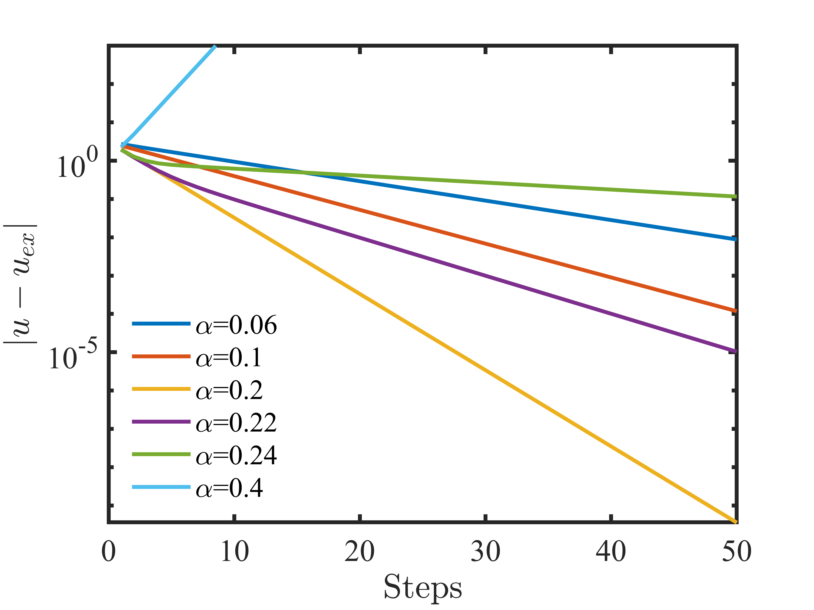

### Richardson Iteration

Author: Yuchen Ge

Date: Fall, 2022

#### **1. Introduction**

   We are concerned with solving a given linear system

$$
   Au=b, \quad A \in {R}^{N \times N}, \quad b \in {R}^N
$$

   by an iteration scheme of the form

$$
   {u}_{k+1}= {u}_k+\alpha\left( {b}-A  {u}_k\right), \quad k=0,1,2, \ldots
$$

   which is called as **Richardson iteration**.
   The basic idea of Richardson iteration is to start with a guess and
   improve it. With different relaxation parameters $\alpha$, the iteration
   may diverge or converge with different speed. We can also convert
   the iteration scheme  into the following form

$$
   {u}_{k+1}=(I-\alpha A ) {u}_k+\alpha {b}
$$

   where $I$ is the unit
   matrix. The definations of the residual and error are listed below:

$$
   {r}={b}-A {v}, \quad r \in {R}^N
$$

$$
   {e}={v}-{u}, \quad e \in {R}^N
$$

   The linear system to be solved is

$$
   \left[\begin{array}{ll}
           6 & 3 \\
           3 & 4
           \end{array}\right]\left[\begin{array}{l}
           x_1 \\
           x_2
           \end{array}\right]=\left[\begin{array}{l}
           -3 \\
           -9
           \end{array}
       \right]
$$

   In **2. Solutions**, the numerical results obtained by
   Richardson iteration with a initial solution $x_0=[0.0,0.0]^T$ and
   different relaxation parameters $\alpha$ are prresented. In addition, a
   discussion on the effects of relaxation parameters and preconditioning
   on the convergence behaviours is provided.

   #### **2. Solutions**

   ##### 2.1. Numerical results of Richardson iteration

   With the aid of MATLAB, the numerical results of different cases have
   been calculated. The convergence curve of the first 50 steps are shown in the figure below.

   

   ##### 2.2. The condition of convergence

   The constrant for the Richardson iteration to convergence is

   $$0<\alpha<\frac{2}{\lambda_{max}}$$ 

   and the optimal relaxation
   parameter $\alpha_{opt}$ and the corresponding spectral radius
   $\rho_{opt}$ for the iteration to convergence are

   $$\alpha_{opt}=\frac{2}{\lambda_{max}+\lambda_{min}}$$

   $$\rho_{opt}=\frac{\lambda_{max}-\lambda_{min}}{\lambda_{max}+\lambda_{min}}$$

   The calculated results are $\alpha_{opt}=0.200000$,
   $\rho_{opt}=0.632456$. And the range of $\rho$ for the Richardson
   iteration to convergence is $(0.000000,0.245030)$. Since $\alpha_6$ is
   out of the convergence range($\alpha_6=0.4>0.245030$), the case of
   $\alpha_6=0.4$ will diverge. And for the given linear system, the
   Richardson iteration converge with $\alpha = 0.06,0.1,0.2,0.22,0.24$. As
   the current relaxation parameter is closer to the $\alpha_{opt}$, the
   iteration converges faster. Hence, from the first figure, we can observe that with
   $\alpha=0.2$ the iteration converges fastest. In addition, if $\alpha$
   is close to the boundary of convergence range, e.g. $\alpha_5=0.24$,
   which is close to $0.245030$, the iteration will converge at a slow
   speed.

   

   ##### 2.3. The case of $\alpha_{opt}$

   The convergence curve with the optimal relaxation parameter
   $\alpha_{opt}$ has been shown in the figure below, which is close to a straight
   line. 

   

   In addition, we are concerned with the rate of convergence $\mu$.
   In this work, the rate of convergence is calculated with errors. We
   assume that the error $e$ finally converges to $e^*=0$, then the rate of
   convergence is

   $$\mu = \lim_{n\rightarrow\infty} \frac{| e_{n+1}-e^*|}{|e_n-e^* |}$$

   After calculating, the rate of convergence is $0.632456$, which is
   consistent with $\rho_{opt}$.

   ##### 2.4. Preconditioning

   In this section, the diagonal elements of $A$ are selected to construct
   the left preprocessor to acceleration the iteration, that is 

   $$M=\left[\begin{array}{ll}
     6 & 0 \\
     0 & 4
    \end{array}\right]$$

   Then the linear system is converted to $A'u=b'$ and the iteration
   equation is converted into the following form:

   $${u}_{k+1}= {u}_k+\alpha  {b'}-\alpha A'  {u}_k$$ 

   where $A'=M^{-1}A$,
   $b'=M^{-1}b$.

   The numerical results of different cases have also been calculated with
   the aid of MATLAB. The convergence curve of the first 50
   steps are shown in the following figure.

   

   ##### 2.5. Discussion

   The figure below shows
  that the acceleration
   effect of preconditioning is not obvious compared to the case of
   $\alpha_{opt}$ discussed in "2.3. The case of $\alpha_{opt}$". 

   

    
   To dig in the reason for this result, the preconditioned linear system
   $A'u=b'$ is rewritten as

   $${u}_{k+1}=(I-\alpha A')  {u}_k+\alpha  {b'}$$

   If ${b'}= {0}$, we get 

   $${u}_k=(I-\alpha A')^k  {u}_0$$ 

   And the
   convergence of the Richardson iteration is determined by the property of
   $(I-\alpha A')$. The spectral radius $\rho'=I-\alpha A'$ is $0.612372$,
   which is close to $\rho_{opt}=0.632456$. This result indicates that the
   rates of convergence of two cases are close, which explains the
   acceleration effect of preconditioning is not obvious.

   Besides, if we select $M^{-1}=A^{-1}$ as the left preconditioner, then
   the exact solution can be calculated with only one step, that is
   $${u}_{k+1} \equiv A^{-1}b ,\quad k=0,1,2, \ldots$$

   #### 3. Readme of codes

   The codes of the corresponding solutions are contained in `Richardson_iteration_MATLAB_version.m`
   and `Richardson_iteration.m`, which are developed by MATLAB. And the Git
   repository is used during the development of codes. By typing *git log*
   in the terminal of the current folder, the development process will be
   displayed.

   In addition, the program written by C language is also developed to
   realise Richardson iteration (see `Richardson_iteration_C_version.c`),
   with the aim of reviewing C language and make better use of C+PETSc.

   

   #### Reference

   1. Michelle Schatzman (2002), Numerical analysis: a mathematical
      introduction, Clarendon Press, Oxford.
